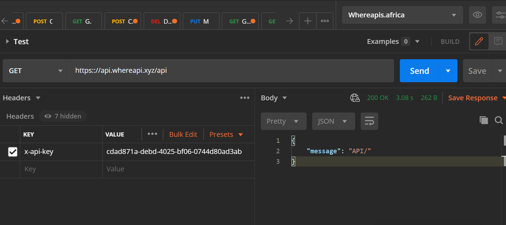

The fastest way to get started with WhereAPI is to create an account.

Next, generate your API keys. Your API keys should look something like this `cdad871a-debd-4025-bf06-0744d80ad3ab`.

Once you have your keys, you can go ahead to consume the API.

:::info
Where implements rate limiting and you can make only 60 requests per hour. This is because it's a minimal setup and this easiest way to keep the server stable and cost efficient.
:::

## Authentication

Once you have your API keys, you can now make requests by passing them with the `x-api-key` header. Here is an example if you're using with a React setup.

### Test with JavaScript (React)

```js
const baseUrl = `https://api.whereapi.xyz/api/`;

// I'm putting the API key here for a straightforward setup.
// You should put set it up as an environmental variable. See
const apiKey = `cdad871a-debd-4025-bf06-0744d80ad3ab`;

useEffect(() => {
    const { data } = await fetch(url, {
        // pass the api key with the x-api-key header
        "x-api-key": apiKey
    });
}, []);
```

### Test with Postman

Or you could try a postman setup. Try sending a get request to `https://api.whereapi.xyz/api` with the `x-api-key` heading set to your api key. It'll look something like this



### Test with curl

curl is a command-line tool for transfering data. It supports HTTP and other protocols. We can test our endpoints with `curl`

```bash
curl -v https://whereapis-africa.herokuapp.com/api/
```

It should return something like this

```bash
StatusCode        : 200
StatusDescription : OK
Content           : {"message":"API/"}
RawContent        : HTTP/1.1 200 OK
                    Connection: keep-alive
                    Content-Length: 18
                    Content-Type: application/json; charset=utf-8
                    Date: Tue, 16 Mar 2021 10:13:09 GMT
                    ETag: W/"12-en1E0QQbd2dl5z1XdkbnvJn4bK0"
                    Server: Cowbo...
Forms             : {}
Headers           : {[Connection, keep-alive], [Content-Length, 18], [Content-Type,
                    application/json; charset=utf-8], [Date, Tue, 16 Mar 2021 10:13:09
                    GMT]...}
Images            : {}
InputFields       : {}
Links             : {}
ParsedHtml        : System.__ComObject
RawContentLength  : 18

```

You can also try to request a protected endpoint without the `x-api-key` set. You'll get an error.

```bash
curl -v https://whereapis-africa.herokuapp.com/api/countries
```

You'll get an error

```bash
curl : {"message":"Authentication error. Please attach an API key to your requests"}
At line:1 char:1
+ curl -v https://whereapis-africa.herokuapp.com/api/countries
+ ~~~~~~~~~~~~~~~~~~~~~~~~~~~~~~~~~~~~~~~~~~~~~~~~~~~~~~~~~~~~
    + CategoryInfo          : InvalidOperation: (System.Net.HttpWebRequest:HttpWebRequest)
   [Invoke-WebRequest], WebException
    + FullyQualifiedErrorId : WebCmdletWebResponseException,Microsoft.PowerShell.Commands.I
   nvokeWebRequestCommand
```

Then pass the `x-api-key` header alongside your key.

```bash
curl -v https://whereapis-africa.herokuapp.com/api/countries -H 'X-Api-Key:cdad871a-debd-4025-bf06-0744d80ad3ab'
```

You should get something like this

```bash
# It should look a bit rougher than this

100   196  100   196    0     0      8      0  0:00:24  0:00:23  0:00:01    42

[
    {
        "id":"f794ecd7-679e-4989-9be6-e081ac2f7145",
        "name":"Nigeria",
        "description":"Largest country in Africa",
        "code":"NG",
        "createdAt":"2021-03-15T10:26:05.644Z",
        "updatedAt":"2021-03-15T10:26:05.644Z"
    }
]
```

:::info
You should use a `bash` program as curl doesn't work on all terminals. Try git bash or someother bash.
:::

If these works, congratulations 🎉🎉🎉. You're set to do whatever you want with the API. Now you have your API keys, let's move to how you would make use of the API.

Onwards 🤺🤺🤺
